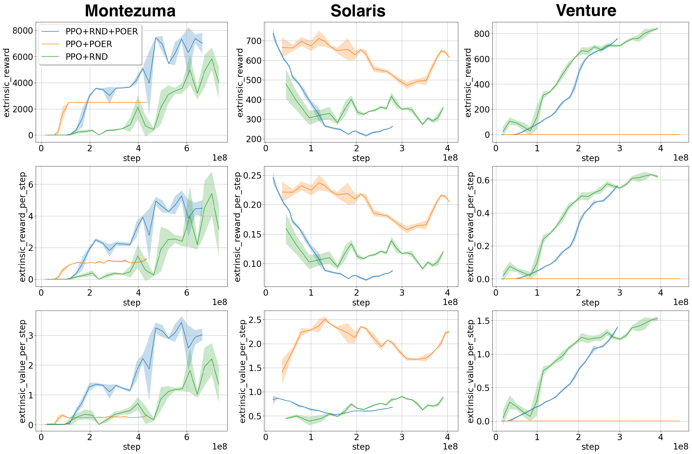

[Combining Experience Replay with Exploration by Random Network Distillation](https://arxiv.org/abs/1905.07579)
==========

Our work is a simple extension of the paper [Exploration by Random Network Distillation](https://arxiv.org/abs/1810.12894). More in detail, we show how to efficiently combine Intrinsic Rewards with Experience Replay in order to achieve more efficient and robust exploration (with respect to PPO/RND) and consequently better results in terms of agent performances and sample efficiency. We are able to do it by using a new technique named Prioritized Oversampled Experience Replay (POER), that has been built upon the definition of what is the important experience useful to replay. Finally, we evaluate our technique on the famous Atari game Montezuma’s Revenge and some other hard exploration Atari games.

This software supports several Deep RL algorithms (A3C, A2C, PPO, GAE, etc..) in different environments with continuous and discrete action spaces. More details about this software can be found in my Computer Science master thesis: [Deep Reinforcement Learning and sub-problem decomposition using Hierarchical Architectures in partially observable environments](https://amslaurea.unibo.it/16718/). 

This project has been tested on Debian 9. The [setup.sh](setup.sh) script installs the necessary dependencies.
Dependencies shared by all environments:
* [Tensorflow](https://www.tensorflow.org/)
* [Scipy](https://www.scipy.org/)
* [Scikit learn](http://scikit-learn.org/stable/index.html)
* [Matplotlib](https://matplotlib.org/)
* [Seaborn](https://seaborn.pydata.org/)
* [ImageIO](https://imageio.github.io/)
* [Sorted Containers](https://pypi.org/project/sortedcontainers/)

Video-games environment dependencies:
* [Gym](https://gym.openai.com/)

Before running setup.sh you must have installed virtualenv, python3-dev, python3-pip and make. 

The [train.sh](train.sh) script starts the training.
The [test.sh](test.sh) script evaluates the trained agent using the weights in the most recent checkpoint.

For manually plotting the training results, please run [framework/plot_results.py](framework/plot_results.py).
If you need to edit the experiment settings, feel free to edit the file [framework/options.py](framework/options.py).

Experiments
-------

Here, the results of some of our experiments in the form of a comparison of our algorithm (PPO/RND/POER) against PPO/RND and PPO/POER. For deeper details about the performed experiments and the evaluation of their results, please read [Combining Experience Replay with Exploration by Random Network Distillation](https://arxiv.org/abs/1905.07579).

Contact
-------

To report issues, use GitHub Issues. For other queries, contact Francesco Sovrano <francesco.sovrano2@unibo.it>